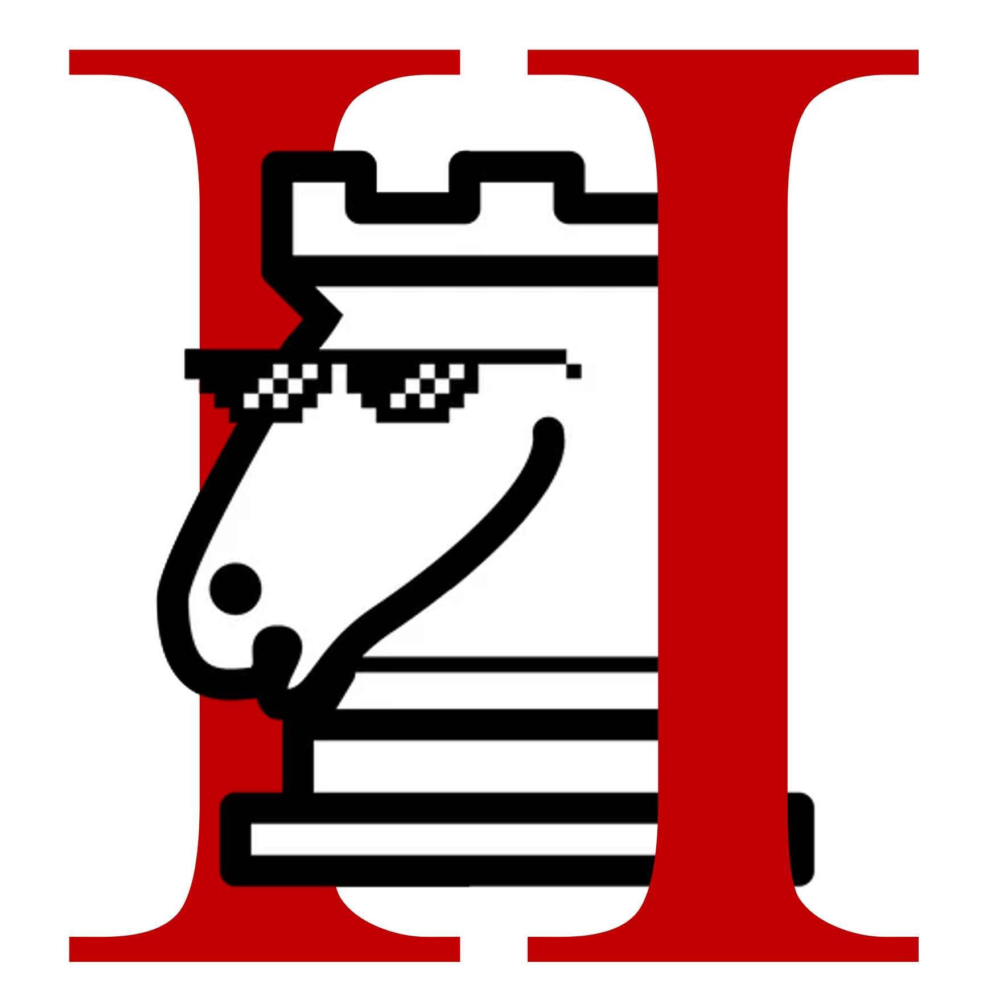

# Wake up babe, Chess 2 has dropped

    

## Bring Chess 2 to your favorite chess platforms

**Features:**

-   automatic redirect from chess.c🤮m to Lichess
-   forced en passant (no more "I didn't know that was a rule")
-   better chat responses

**A peak inside:**

https://github.com/user-attachments/assets/27f32a2d-57c3-401a-b0cc-d9102a60a309

**How to install:**
The browser extension is available in all major browsers (just to be clear, that excludes Safari). If you _must_ use chess.c🤮m, you have to disallow Chess 2 from
accessing data on that site.

**How to contribute:**
There are numerous features that need to be added to Chess 2. Here is a list of some ideas:
- il Vaticano
- double check win
- vertical castling
- ... (see full list [here](https://www.reddit.com/r/AnarchyChess/wiki/index/))

Most of the upcoming features need both players to play Chess 2. Then, the browser add-on can automatically draw and continue from the new position, if a special move was made.

